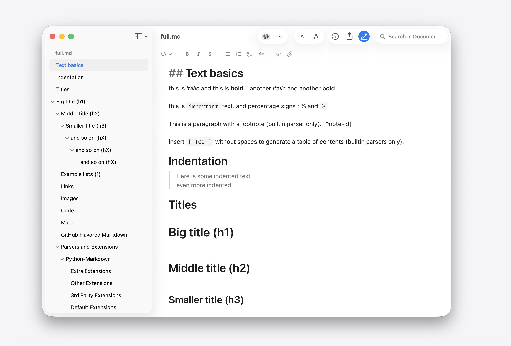

<h1 align="center">Markdown Preview</h1>

<p align="center">
  
</p>

<p align="center">
  一款快速、原生的 macOS Markdown 阅读与编辑应用。
</p>

<p align="center">&nbsp;&nbsp;&nbsp;&nbsp;</p>

---

> 将 `.md` 文件拖到图标上（或将 Markdown Preview 设为默认打开程序），即可获得清晰的、可滚动的预览视图，并带有文档大纲——没有 Electron，没有浏览器标签页。

## 安装

```sh
brew install --cask pluk-inc/tap/markdown-preview
```

或者从 [Releases](https://github.com/pluk-inc/markdown-preview/releases) 页面下载最新已签名并公证的 DMG 安装包。

## 多语言支持

此分支的 Markdown Preview 现在支持中文界面！应用启动时会自动跟随系统语言设置。如需手动切换：

```sh
# 切换到中文界面
defaults write doc.md-preview AppleLanguages '(zh-Hans)'
# 切换回英文界面
defaults write doc.md-preview AppleLanguages '(en)'
```

Fork from [https://github.com/pluk-inc/markdown-preview](https://github.com/pluk-inc/markdown-preview)


## 截图

<p align="center">
  
</p>

<p align="center">
  <em>直接编辑 Markdown，内置原生格式工具栏：</em>
</p>

<p align="center">
  
</p>

<p align="center">
  <em>Quick Look 预览——在 Finder 中按下空格键查看 <code>.md</code> 文件：</em>
</p>

<p align="center">
  
</p>

<p align="center">
  <em>自定义工具栏——从"显示 → 自定工具栏…"中拖入打印、复制、缩放等工具：</em>
</p>

<p align="center">
  
</p>

## 功能特性

- **原生渲染** — 基于 `WKWebView` 和 [swift-markdown](https://github.com/swiftlang/swift-markdown) 构建的渲染管线，支持标题锚点和链接处理。
- **编辑模式** — 原地编辑 Markdown，附带标题、强调、列表、引用、代码和链接的格式工具栏。从工具栏或按 <kbd>⌘E</kbd> 启 动，按 <kbd>⌘S</kbd> 保存。
- **Mermaid 图表** — 围栏式 `mermaid` 代码块在应用和 Quick Look 预览中均可渲染为图表，使用内置渲染器，离线也可用，无需 CDN 请求。
- **数学公式** — LaTeX 行内（`$x_1 + x_2$`）、展示（`$$\int_0^1 x^2\,dx$$`）和围栏式 `math` 代码块均使用内置 KaTeX 渲染。选中已渲染的公式后复制，会得到原始的 LaTeX 源码。
- **文档大纲** — 侧边栏目录，自动关联各级标题；点击即可跳转。
- **检查器面板** — 可切换的侧边面板，显示文件元数据。
- **文档内搜索** — 工具栏搜索框，支持标准 <kbd>⌘F</kbd> / <kbd>⌘G</kbd> / <kbd>⌘⇧G</kbd> 快捷键，可前后切换匹配项。
- **用其他应用打开** — 不离开预览即可切换到你的编辑器（VS Code、Cursor、Zed、Sublime、BBEdit、Nova、CotEditor、TextMate、MacVim、Xcode、TextEdit）。列表会自动过滤出实际声明了 Markdown 编辑器角色的应用，并记住你的选择。
- **在 LLM 中打开** — 从工具栏直接将当前 Markdown 文件发送到 Codex、Claude 或 ChatGPT。支持的应用会尽可能带上文件或文件夹上下文打开，超长内容则自动回退到复制粘贴方式。
- **文本缩放** — 通过触控板捏合、工具栏的 <kbd>A A</kbd> 控件或 <kbd>⌘+</kbd> / <kbd>⌘−</kbd> / <kbd>⌘0</kbd> 快捷键调节预览字号。提供从 50% 到 300% 的离散档位，与 Safari 风格一致。
- **可定制工具栏** — 通过"显示 → 自定工具栏…"拖入你需要 的工具（打印、复制、缩放、侧边栏、用其他应用打开、检查器、分享、搜索）。标准 AppKit 交互，布局会跨启动保持。
- **分享 = 复制源码** — 分享工具栏将 Markdown 文本本身提供给分享面板，因此**复制**操作会将原始源码写入剪贴板（方便粘贴到 ChatGPT / Claude），而邮件、信息和备忘录则会获得正文内容而非文件链接。
- **Quick Look 扩展** — 系统级的 `.md` 文件预览，支持 Finder 空格键、Spotlight 和邮件附件，无需启动应用。
- **命令行工具** — 从应用菜单安装 `mdp`、`md-preview` 和 `markdown-preview`，然后在终端中使用 `mdp README.md` 或 `mdp .` 等命令打开文件或文件夹。
- **默认打开程序** — 首次启动时会主动询问是否将自己注册为 `.md` 文件的默认打开程序。

## 支持的文件类型

`.md`、`.markdown`、`.mdown`、`.txt`
UTI：`net.daringfireball.markdown`

## 系统要求

- macOS 15 或更高版本
- Apple Silicon 或 Intel

## 从源码构建

```sh
git clone git@github.com:pluk-inc/markdown-preview.git
cd markdown-preview
open markdown-preview.xcodeproj
```

构建并运行 `markdown-preview` scheme。Swift Package Manager 会在首次构建时自动解析 [Sparkle](https://github.com/sparkle-project/Sparkle)、[Sentry](https://github.com/getsentry/sentry-cocoa) 和 [swift-markdown](https://github.com/swiftlang/swift-markdown) 依赖。

### 崩溃报告

发布版本会向 `pluk-inc/markdown-preview` 的 Sentry 项目提交原生崩溃报告。该集成不会收集性能追踪、会话数据、运行轨迹、网络请求、用户信息、文档内容或文件路径。用户可以直接从 Markdown Preview > 发送匿名崩溃报告 中关闭该功能；关闭后，后续启动时 Sentry SDK 将完全不会初始化。

提交的 DSN 是公开的客户端密钥。发布归档时使用 `sentry-cli` 上传应用的 dSYM 文件；本地使用 `sentry-cli login` 进行身份验证，并将身份验证令牌保存在仓库之外。

## 项目结构

```
md-preview/         主应用目标（AppKit、WKWebView）
quick-look/         Quick Look 扩展（.appex）
scripts/            发布与回滚自动化脚本
Version.xcconfig    营销版本号与构建版本号（唯一数据源）
appcast.xml         Sparkle 更新源
```

## 发布流程

发布由 [Amore](http://amore.computer/) 驱动——它在一个步骤中完成构建、代码签名、公证、DMG 创建、S3 上传和 Sparkle appcast 发布。

修改 `Version.xcconfig` 中的 `MARKETING_VERSION` 和 `CURRENT_PROJECT_VERSION`，然后：

```sh
./scripts/release.sh
```

如果发布出现问题，使用 `./scripts/rollback-release.sh` 回退 appcast 指针。

## 贡献指南

欢迎提交 Pull Request。对于较大的改动，请先提交 issue 讨论你想要修改的内容。

1. Fork 本仓库并从 `main` 分支创建你的分支。
2. 运行应用并端到端验证改动（UI 改动需要手动冒烟测试——目前尚无 UI 测试套件）。
3. 保持 PR 聚焦，每个 PR 只做一个逻辑改动。
4. 遵循现有的 Swift 代码风格（没有强制格式化工具；模仿附近代码即可）。

<h2 align="center" style="color: #8a8a8a;">特别赞助商</h2>

<br />

<p align="center">
  <a href="https://pluk.sh">
    
  </a>
  &nbsp;&nbsp;&nbsp;&nbsp;
  <a href="https://amore.computer">
    
  </a>
</p>

## 鸣谢
- [Amore](http://amore.computer/) — macOS 发布自动化（签名、公证、DMG、托管、appcast）
- [swift-markdown](https://github.com/swiftlang/swift-markdown) — Markdown 解析器（Apple，基于 cmark-gfm）
- [Mermaid](https://mermaid.js.org/) — 内置图表渲染器，支持 `mermaid` 围栏代码块
- [KaTeX](https://katex.org/) — 内置数学排版引擎，支持行内 `$…$`、展示 `$$…$$` 和 ` ```math ` 代码块
- [Sparkle](https://sparkle-project.org) — 自动更新框架
- [Sentry](https://sentry.io) — 隐私过滤的原生崩溃报告
- [LottieFiles](https://lottiefiles.com/) — 动画版 README 图标

## 许可证

[MIT](LICENSE)
