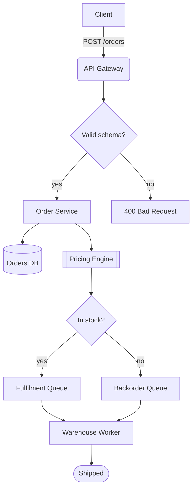
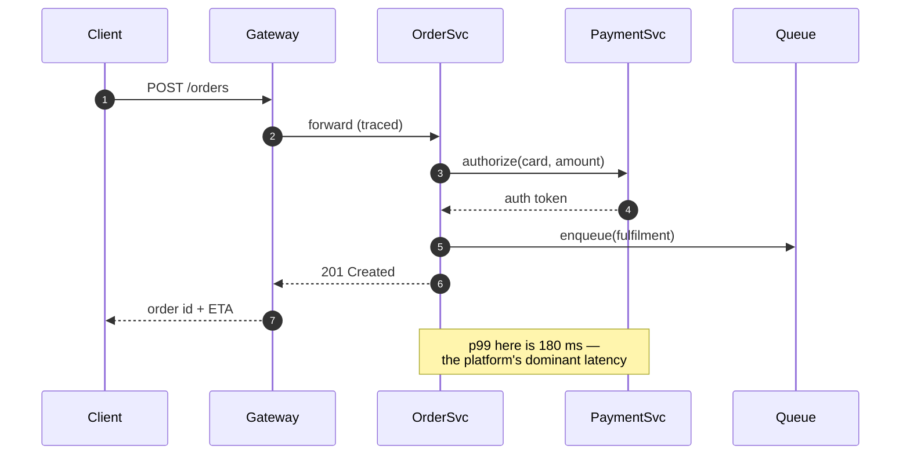
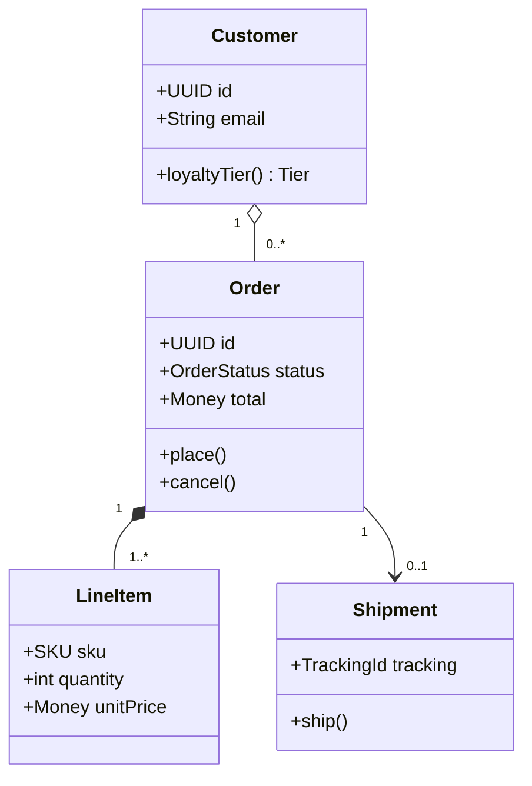
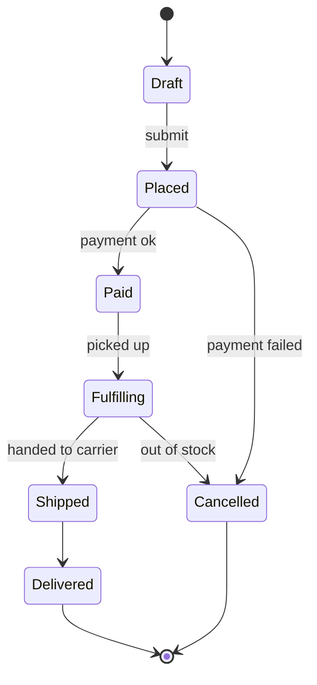
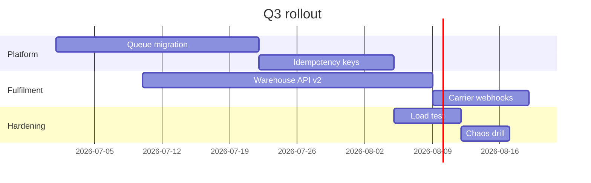
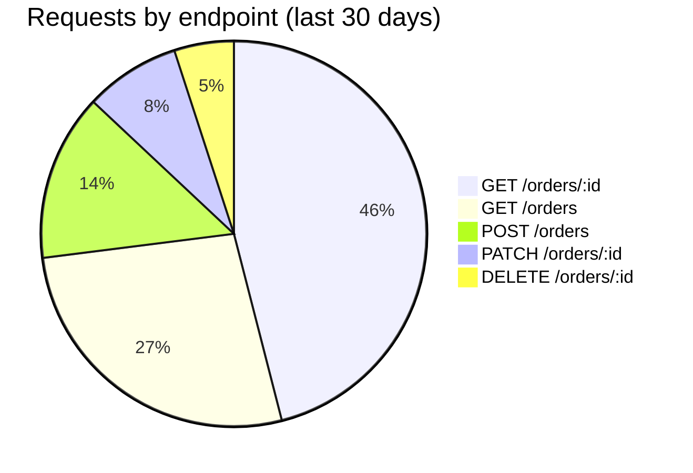
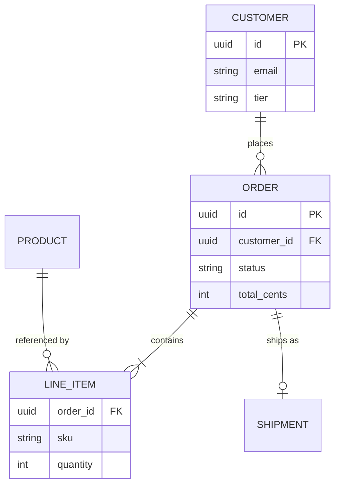
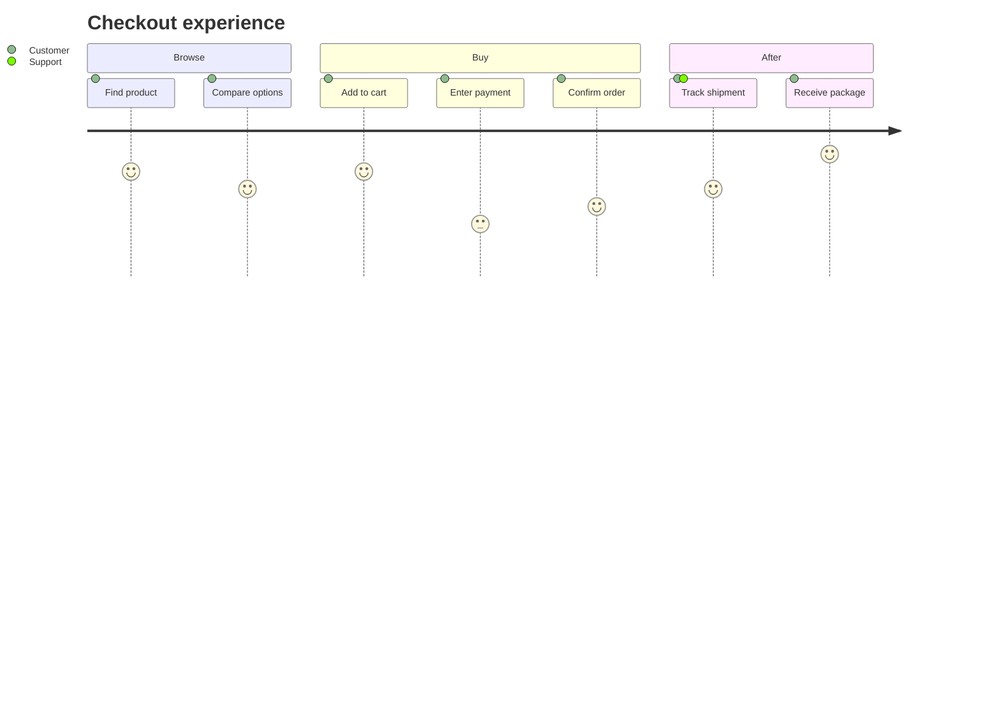
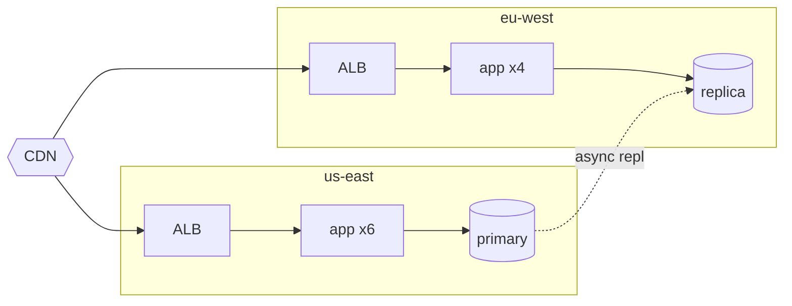
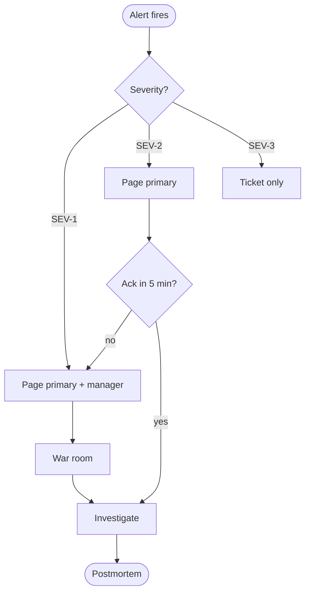

# Order Processing Platform — Architecture Notes

This document describes the order processing platform end to end: ingestion,
validation, fulfilment, and reporting. It intentionally leans on diagrams so
that every subsystem has a picture next to its prose. It doubles as a stress
test for the preview renderer — Mermaid, code highlighting, and math all
appear below.

## 1. System overview

Orders arrive over HTTPS, are validated, priced, and dispatched to a
fulfilment queue. The happy path takes under 300 ms at the median; the tail
is dominated by payment authorization.



The gateway terminates TLS and applies per-tenant rate limits. Everything
downstream of the Order Service is asynchronous.

## 2. Order placement sequence

The critical path involves four services. Payment authorization is the only
synchronous external call.



## 3. Domain model

The core aggregate is `Order`; everything else hangs off it.



## 4. Order lifecycle

Status transitions are strictly forward except for the cancellation edges.



## 5. Delivery milestones

The Q3 rollout is sequenced so the queue migration lands before peak season.



## 6. Traffic mix

Read traffic dwarfs writes, which shapes the caching strategy.



## 7. Storage schema

The relational core stays small; large payloads live in object storage.



## 8. Customer journey

Support tickets cluster around the payment step, which matches the journey
scores below.



## 9. Deployment topology

Each region runs the full stack; cross-region traffic is replication only.



## 10. Incident escalation

Paging follows severity; only SEV-1 wakes the on-call manager.



## Appendix A: Client snippet

The Swift client retries idempotently using the server-issued key:

```swift
struct OrderClient {
    let session: URLSession
    let idempotencyKey: UUID

    func place(_ order: OrderDraft) async throws -> OrderReceipt {
        var request = URLRequest(url: endpoint.appending(path: "orders"))
        request.httpMethod = "POST"
        request.setValue(idempotencyKey.uuidString,
                         forHTTPHeaderField: "Idempotency-Key")
        request.httpBody = try JSONEncoder().encode(order)
        let (data, response) = try await session.data(for: request)
        guard (response as? HTTPURLResponse)?.statusCode == 201 else {
            throw OrderError.rejected
        }
        return try JSONDecoder().decode(OrderReceipt.self, from: data)
    }
}
```

The TypeScript worker drains the fulfilment queue in batches:

```typescript
async function drain(queue: Queue<OrderEvent>, batchSize = 32): Promise<void> {
  while (true) {
    const events = await queue.take(batchSize, { waitMs: 500 });
    if (events.length === 0) continue;
    const results = await Promise.allSettled(events.map(fulfil));
    for (const [i, r] of results.entries()) {
      if (r.status === "rejected") await queue.deadLetter(events[i], r.reason);
    }
  }
}
```

Operators replay dead letters with a one-liner:

```bash
for id in $(dlq list --queue fulfilment --format ids); do
  dlq replay "$id" && echo "replayed $id"
done
```

## Appendix B: Capacity math

Peak load is provisioned from the queueing model. With arrival rate
$\lambda = 420$ req/s and per-worker service rate $\mu = 55$ req/s, the
utilization per worker is $\rho = \lambda / (c \mu)$ for $c$ workers.

Expected wait in an M/M/c queue:

$$
W_q = \frac{C(c, \lambda/\mu)}{c\mu - \lambda}
\qquad
C(c, a) = \frac{\dfrac{a^c}{c!}\,\dfrac{c}{c-a}}
               {\sum_{k=0}^{c-1} \dfrac{a^k}{k!} + \dfrac{a^c}{c!}\,\dfrac{c}{c-a}}
$$

With $c = 10$ workers, $\rho \approx 0.76$ and $W_q < 12$ ms, which leaves
headroom for a single-AZ failure ($c = 7$, $\rho \approx 0.99$ — too hot, so
the fleet floor is 12).
