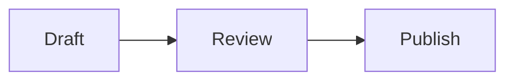

# Mixed formatting document

A paragraph with **bold phrase**, *italic phrase*, ~~deleted phrase~~, ==highlighted phrase==, `inlineToken`, and an [inline link](https://example.com). It combines styles in one line and wraps naturally in narrow windows.

## Heading two
### Heading three
#### Heading four
##### Heading five
###### Heading six

Setext one
==========

Setext two
----------

A paragraph before lists.

- Parent bullet
  - Nested bullet
    - Deep bullet
  - Another nested bullet
- Final bullet with **bold list text** and enough ordinary words to wrap across more than one line in a narrow window.

1. Ordered parent
   1. Nested ordered item
   2. Second nested ordered item
2. Final ordered item

> Quotation first paragraph with **quoted emphasis**.
>
> Quotation second paragraph.
> > Nested quotation.

After nested quotation.

---

Before fenced code.

```swift
struct LayoutExample {
    let greeting = "Hello"
}
```

After fenced code.

```
plainCodeLine
secondPlainLine
```

    indentedCodeLine
    secondIndentedLine

After indented code.

| Left heading | Center heading | Right heading |
| :--- | :---: | ---: |
| Left cell | Center cell | 123 |
| Longer cell that wraps at narrow widths | Unicode café 日本語 | 456 |

After table.

Before first mixed image.


After first mixed image.

[](https://example.com)

After linked mixed image.



After diagram.

## Unicode and direction

English café, 日本語, emoji 🧪 and combining é.

هذه فقرة عربية لاختبار اتجاه النص والمحاذاة.

פסקה בעברית לבדיקת כיוון הטקסט.

After multilingual paragraphs.

An escaped \*literal star\* and literal\_underscore.

First hard break.  
Second hard break.

One soft line
continues here.

Before extra blank lines.


After extra blank lines.

Final mixed paragraph.
