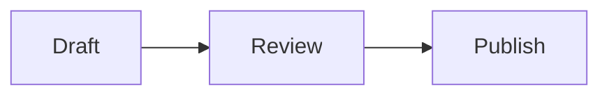

# Extended mixed document

A **bold introduction** before render-only features.

- [ ] Unchecked task
- [x] Completed task

# Mixed formatting document

A paragraph with **bold phrase**, *italic phrase*, ~~deleted phrase~~, ==highlighted phrase==, `inlineToken`, and an [inline link](https://example.com). It combines styles in one line and wraps naturally in narrow windows.

## Heading two
### Heading three
#### Heading four
##### Heading five
###### Heading six

Setext one
==========

Setext two
----------

A paragraph before lists.

- Parent bullet
  - Nested bullet
    - Deep bullet
  - Another nested bullet
- Final bullet with **bold list text** and enough ordinary words to wrap across more than one line in a narrow window.

1. Ordered parent
   1. Nested ordered item
   2. Second nested ordered item
2. Final ordered item

> Quotation first paragraph with **quoted emphasis**.
>
> Quotation second paragraph.
> > Nested quotation.

After nested quotation.

---

Before fenced code.

```swift
struct LayoutExample {
    let greeting = "Hello"
}
```

After fenced code.

```
plainCodeLine
secondPlainLine
```

    indentedCodeLine
    secondIndentedLine

After indented code.

| Left heading | Center heading | Right heading |
| :--- | :---: | ---: |
| Left cell | Center cell | 123 |
| Longer cell that wraps at narrow widths | Unicode café 日本語 | 456 |

After table.

Before first mixed image.


After first mixed image.

[](https://example.com)

After linked mixed image.



After diagram.

## Unicode and direction

English café, 日本語, emoji 🧪 and combining é.

هذه فقرة عربية لاختبار اتجاه النص والمحاذاة.

פסקה בעברית לבדיקת כיוון הטקסט.

After multilingual paragraphs.

An escaped \*literal star\* and literal\_underscore.

First hard break.  
Second hard break.

One soft line
continues here.

Before extra blank lines.


After extra blank lines.

Final mixed paragraph.

## Equations

Inline formula $x_1 + x_2$ inside a paragraph.

$$
\int_0^1 x^2\,dx
$$

```math
E = mc^2
```

After equations.

> [!NOTE]
> Note body with **strong text**.

> [!TIP]
> Tip body.

> [!IMPORTANT]
> Important body.

> [!WARNING]
> Warning body.

> [!CAUTION]
> Caution body.

After alerts.

A referenced [reference link][destination] and an autolink <https://example.com/path>.

![Reference picture][picture]

After reference image.

A footnote marker[^first] and a repeated footnote[^first].

<details>
<summary>Expandable summary</summary>
<p>Expanded HTML body with <strong>HTML emphasis</strong>.</p>
</details>

<p align="center"></p>

<div dir="rtl">نص عربي داخل عنصر HTML.</div>

After raw HTML.

| Formatting | Example |
| --- | --- |
| Inline table styles | **bold cell**, *italic cell*, `codeCell` |
| Escaped pipe | left\|right |

```javascript
const finalValue = 42;
```

Final extended paragraph.

[destination]: https://example.com/reference "Reference title"
[picture]: {{IMAGE}}
[^first]: Footnote definition with **footnote emphasis**.
